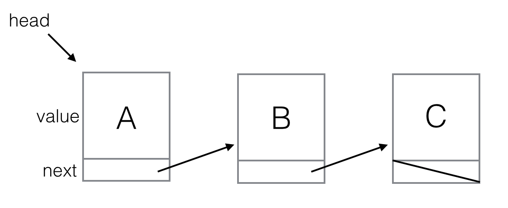

# Linked Lists
This document provides a mini course in linked lists in JavaScript.

A "linked list" is a data structure that stores a list of values.

Linked lists are like arrays, except they have different performance characteristics.

## Prerequisites

Familiarity with JS, particularily object-oriented programming in JS. 

## Contents

- [Lecture 1. Recursion](#lec1)
 - Fibonacci numbers
 - Unit Testing
 - Unwinding `fibonacci(...)`
 - Proof that `fibonacci(n)` terminates for all values of *n*, where *n* >= 1
- [Lecture 2. Node `append(...)`](#lec2)
 - Linked Lists
 - Visualization
- [Lecture 3. Tips for developing recursive functions](#lec3)
 - Tip 1. Document the function
 - Tip 2. Base case and recursive case
 - Tip 3. Make progress every step of the way
 - Tip 4. Assume correctness
 - Tip 5: Analyze the corner cases
- [Lecture 4. `prepend(...)`](#lec4)
 - Analyzing the performance of `append(...)`
 - Analyzing the performance of `prepend(...)`
 - Summary
- [Lecture 5. `removeFirst(...)`] (#lec5)
- [Lecture 6. `removeLast(...)`] (#lec6)
 - Use Tip 1: Document function
 - Use Tip 2: Base case and recursive case
 - Use Tip 5: Analyze the corner cases
 - Use Tips 3 & 4: Make progress and assume correctness
 - Complete implementation of `removeLast(...)`
- [Lecture 7. `removeValue(...)`] (#lec7)

<br><br><br><br>

## <a name="lec1">Lecture 1. Recursion</a>

> "In order to understand recursion, one must first understand recursion."

A linked list is a "recursive" data structure, and uses "recursive" algorithms.

Recursive simply means self referential.

Rather than elucidating further in English, we'll just dive into the classic example: Fibonacci numbers.

### Fibonacci numbers

Here are the first 9 Fibonacci numbers:
 
1, 1, 2, 3, 5, 8, 13, 21, 34, ...
 
Do you see the pattern?
 
The pattern is this: every Fibonacci number equals the sum of the previous two Fibonacci numbers.

Except for the first two Fibonacci numbers -- the "base cases." By fiat, they are defined to be equal to 1.

Let's write a JS function that computes the *nth* Fibonacci number.

### `index.html`

```html
<!DOCTYPE html>
<html>
  <head>
    <title>Linked Lists</title>
    <script src="linked-lists.js"></script>
  </head>
</html>
```

### `linked-lists.js`

```js
function fibonacci(n) {
  if (n <= 0) {
    console.error("Fiboncci numbers are not defined when n <= 0");
  } else if (n == 1 || n == 2) {
    return 1;
  } else {
    return fibonacci(n - 1) + fibonacci(n - 2);
  }
}

console.log(fibonacci(1));
console.log(fibonacci(2));
console.log(fibonacci(3));
console.log(fibonacci(4));
console.log(fibonacci(5));
console.log(fibonacci(6));
```

View your JS console to verify that `fibonacci(...)` computes the first 6 Fibonacci numbers correctly.

Actually, it would be better to *unit test* the `fibonacci(...)` function, rather than viewing results
on the console.

### Unit Testing

A *unit test* is a piece of code that tests a single unit of code.

Unit testing is awesome and essential.

Here's a unit test for `fibonacci(...)`:

```js
function assert(condition) {
    if (!condition) {
        console.error("Test failed");
    }
}

assert(fibonacci(1) == 1);
assert(fibonacci(2) == 1);
assert(fibonacci(3) == 2);
assert(fibonacci(4) == 3);
assert(fibonacci(5) == 5);
assert(fibonacci(6) == 8);
```

### Unwinding `fibonacci(...)`

Let's trace the code and see what happens when we call `fibonacci(3)`.

- `fibonacci(3)` calls `fibonacci(2)` (*n* - 1)
  - `fibonacci(2)` returns `1`
- `fibonacci(3)` calls `fibonacci(1)` (*n* - 2)
  - `fibonacci(1)` returns `1`
- `fibonacci(3)` sums the result of `fibonacci(2)` and `fibonacci(1)`, and returns 2 (which is 1 + 1)

Ok.  Now let's trace a call to `fibonacci(4)`

- `fibonacci(4)` calls `fibonacci(3)` (*n* - 1)
  - The entire call sequence for `fibonacci(3)` executes (see above) and yields 2
- `fibonacci(4)` calls `fibonacci(2)` (*n* - 2)
  - `fibonacci(2)` returns `1`
- `fibonacci(4)` sums the result of `fibonacci(3)` and `fibonacci(2)`, and returns 3 (which is 2 + 1)

Get it?

### Proof that `fibonacci(n)` terminates for all values of *n*, where *n* >= 1

This section is optional. I present it just in case you enjoy proofs using mathematical induction.

Recall, a proof via [strong induction](https://en.wikipedia.org/wiki/Mathematical_induction)
works as follows:

- Base case: Prove that the theorem holds when *n* == 1
- Inductive step: Prove that if the theorem holds for all *n* (where 1 <= n), then the theorem also holds for *n + 1*

#### Theorem

`fibonacci(n)` terminates for all values of *n*, where *n* >= 1
 
#### Proof

##### Base case

Clearly, the `fibonacci(n)` function terminates when *n* == 1.

##### Inductive step

Assumption 1: Assume `fibonacci(n)` terminates for all 1 <= *n*.

`fibonacci(n + 1)` invokes `fibonacci(n)` and `fibonacci(n - 1)`.

Therefore if `fibonacci(n)` and `fibonacci(n - 1)` terminate, then `fibonacci(n + 1)` terminates.

Case analysis:

- Case A: If *n == 1*, then `fibonacci(n + 1)` clearly terminates
- Case B: If *n > 1*, then `fibonacci(n + 1)` invokes `fibonacci(n)` and `fibonacci(n - 1)`. Since *n > 1*, we know *1 <= n - 1 < n*, and because we are assuming Assumption 1, we know both of those invocations terminate.

Therefore, `fibonacci(n + 1)` clearly terminates in all cases.

QED.

<br><br><br><br>

## <a name="lec2">Lecture 2. Node `append(...)`</a>

Study the `Node` class, and type it in to `linked-lists.js`:

```js
class Node {
    constructor(value) {
        this.value = value;
        this.next = undefined;
    }

    // Creates a new node to hold value, and appends the new node to the end
    // of this list.
    //
    // Doesn't return anything.
    append(value) {
        if (this.next == undefined) {
            this.next = new Node(value);
        } else {
            this.next.append(value);
        }
    }
}
```

You use it like this:

```js
var head = new Node("A");
head.append("B");
head.append("C");

assert(head.value == "A");
assert(head.next.value == "B");
assert(head.next.next.value == "C");
assert(head.next.next.next == undefined);
```

Add the `Node` class and usage example into `linked-lists.js`.

### Linked Lists

Node objects link together via the *next* field.

A chain of nodes is called a linked list.

### Visualization

To help make sense of linked lists, we visualize them like so:



<br><br><br><br>


## <a name="lec3">Lecture 3. Tips for developing recursive functions</a>

This lecture may sound like gibberish now.

That's fine because we will concretely explore
how these tips apply to many recursive functions throughout this mini course.

### Tip 1. Document the function

Before you begin coding a recursive function, you should document the function.
Specifically, you should precisely document the input to the function, the
return-value for the function, and any side effects.

```js
// Creates a new node to hold value, and appends the new node to the end
// of this list.
//
// Doesn't return anything.
append(value) {
  // ?
}
```

### Tip 2. Base case and recursive case

Every recursive function has at least one "base case" and at least one
"recursive case."

```js
append(value) {

    // base case
    if (this.next == undefined) {
        this.next = new Node(value);
    }

    // recursive case
    else {
        this.next.append(value);
    }
}
```

#### Base case

A *base case* is a case that does not invoke recursion (because there is no longer a need for recursion).

For example, if your recursive function is searching for the last element in the list (as in `append(...)`),
the base case would be the case where the last element has been reached.

Write the base case(s) before you write the recursive case.

If it's not clear how to implement the base case right away, then first document (A) when the base case occurs,
and (B) what should be done in the base case.

#### Recursive case

For a function `f(...)`, the recursive case is the case that invokes `f(...)` recursively.

### Tip 3. Make progress every step of the way

For a recursive function `f(X)`, the recursive case must invoke `f(...)`.

However, it must not invoke `f(X)`, because that would lead to an infinite loop.

Rather, each recursive case must make some progress.

For instance:

- For `f(n)`, the recursive case might call `f(n - 1)`
- For `f(node)`, the recursive case might call `f(node.next)`

In the `append(...)` example below, the recurisve case makes
progress by invoking `append` on `this.next`. 

```js

// Creates a new node to hold value, and appends the new node to the end
// of this list.
//
// Doesn't return anything.
append(value) {

    // base case
    if (this.next == undefined) {
        this.next = new Node(value);
    }

    // recursive case
    else {
        this.next.append(value);
    }
}
```

### Tip 4: Assume correctness

When developing the recursive case **you must assume your function invocation always works exactly as advertised**
(according to the documentation).

It's kind of like the inductive step in an inductive proof.

### Tip 5: Analyze the corner cases

In a linked list the corner cases that tend to arise are:

- (A) `this` == first node AND `this` == last node
- (B) `this` == first node AND `this` != last node
- (C) `this` != first node AND `this` == last node
- (D) `this` != first node AND `this` != last node

Make sure your recursive function works for all corner cases.

#### Example

Let's revist the `append(...)` function:

```js

// Creates a new node to hold value, and appends the new node to the end
// of this list.
//
// Doesn't return anything.
append(value) {

    // base case
    if (this.next == undefined) {
        this.next = new Node(value);
    }

    // recursive case
    else {
        this.next.append(value);
    }
}
```

Analyzing the corner cases for `append(...)`:

##### 1. What if `this` == the first node?

In this case, it could either be the base case or the recursive case,
so we need to make sure `append(...)` works for both of these
cases when `this` == the first node.

Analyze the code:

If `this` == the first node, the base case will work just fine.

If `this` == the first node, the recursive case will work just fine.

##### 2. What if `this` == the last node?

If `this` == the last node, then `this.next` == undefined
(because that's how linked lists signify the end of the list).

Therefore, the base case will execute.

And the base case executes the desired behavior for the `append(...)` function.

##### 3. `this` == first node and `this` == last node

Just like Case 2 (immediately above), the base case executes the desired behavior for the `append(...)` function.

##### 4. `this` != first node and `this` != last node

Since this is not the last node, then `this.next` will be defined, so we only
need to look at the recursive case. The recursive case looks correct in this case.

<br><br><br><br>


## <a name="lec4">Lecture 4. `prepend(...)`</a>

Study the `prepend` method and its tests. Type in `prepend` and its tests into `linked-lists.js`.

```js
class Node {

   ...

   // Creates a new node to hold value, and prepends the new node to this list
   // making the new node the head of the list.
   //
   // Returns a reference to the new head of the list (which is the newly
   // created node).
   prepend(value) {
     var newNode = new Node(value);

     newNode.next = this;

     return newNode;
   }
}

// Test prepend(...)
var head = new Node("A");
head = head.prepend("B");
head = head.prepend("C");

var cNode = head;
var bNode = cNode.next;
var aNode = bNode.next;

assert(aNode.value == "A");
assert(bNode.value == "B");
assert(cNode.value == "C");
assert(aNode.next == undefined);
```

Which is more efficient: `append(...)` or `prepend(...)`?

### Analyzing the performance of `append(...)`

It should be clear that the amount of time it takes 
to execute `append(...)` is proportional to the size of the linked list.

For example, if a linked list has 1 billion nodes, then it will
take a long time to execute `append(...)`.

In computer science terminology and notation, we
say the time performance of `append(...)` is *O(N)*, where *N* is the size of the list.

This is called "Big Oh" notation. In a college-level algorithms course, you would
learn the formal mathematical definition of Big O and Big O analysis. In this
mini course, however, we satisfy ourselves with an informal, rough understanding of Big O.

### Analyzing the performance of `prepend(...)`

If should be clear that the amount of time it takes to 
execute `prepend(...)` is independent of the size of the linked list.

To be more precise, `prepend(...)` takes a constant (i.e. non variable)
amount of time to execute.

Therefore we say the time performance of `prepend(...)` is *O(1)*  (since 1 is a constant).

### Summary

- `append(...)` is *O(N)* -- slow
- `prepend(...)` is *O(1)* -- fast

<br><br><br><br>

## <a name="lec5">Lecture 5. `removeFirst(...)`</a>

Study the `removeFirst` method and its tests. Type in `removeFirst` and its tests into `linked-lists.js`.

```js
class Node {
 
    ...

    // Deletes the first node in this list.
    //
    // Returns [v, head] where v is the value that was removed, and head
    // is a reference to the new head (possibly undefined).
    removeFirst() {
        return [this.value, this.next];
    }
}

// Test removeFirst(...)
var head = new Node("A");
head.append("B");
head.append("C");

var [aValue, bNode] = head.removeFirst();
var [bValue, cNode] = bNode.removeFirst();
var [cValue, undef] = cNode.removeFirst();

assert(aValue == "A");
assert(bValue == "B");
assert(cValue == "C");

assert(bNode.value == "B");
assert(cNode.value == "C");
assert(undef == undefined);

```

`removeFirst(...)` is *O(1)*

<br><br><br><br>

## <a name="lec6">Lecture 6. `removeLast(...)`</a>

Let's implement `removeLast(...)`.

```js
class Node {

    // Deletes the last node in this list.
    //
    // Returns [v, newHead] where v is the value that was removed, and
    // newHead is the new head of the list (possibly undefined).
    removeLast() {
        // ?
    }
}
```

Recall the following tips for developing recursive functions:

- Tip 1. Document the function
- Tip 2. Base case and recursive case
- Tip 3. Make progress every step of the way
- Tip 4. Assume correctness
- Tip 5: Analyze the corner cases

Let's build the function by going through each of the tips.

### Use Tip 1: Document function

The function is already documented

### Use Tip 2: Base case and recursive case

Here, the base case is when we've reached the end of the list, i.e. when `this.next == undefined`:

```js
// Deletes the last node in this list.
//
// Returns [v, newHead] where v is the value that was removed, and
// newHead is the new head of the list (possibly undefined).
removeLast() {
    
    // base case: if we've reached the end of the list
    if (this.next == undefined) {
        // modify the list so that this node is no longer the last
    }
    
    // recursive case
    else {
        // ?
    }
}
```

### Use Tip 5: Analyze the corner cases

To implement the base case let's consider the corner cases.
Keep in mind, we want to modify the list so that `this` node is no longer the last.

Recall, in a linked list the corner cases that tend to arise are:

- (A) `this` == first node AND `this` == last node
- (B) `this` == first node AND `this` != last node
- (C) `this` != first node AND `this` == last node
- (D) `this` != first node AND `this` != last node

#### (A) `this` == first node AND `this` == last node

In this case, we simply return `[this.value, undefined]`.

#### (B) `this` == first node AND `this` != last node

This corner case does not apply to the base case, because `this` is guaranteed to be the last node in the base case.

#### (C) `this` != first node AND `this` == last node

In this case, we want to find the previous node, say `prev`, and set `prev.next` to undefined.

Then we want to return `[this.value, head]`, where `head` is the first node of the list.

Now we have two problems:

1. As currently implemented, we don't have a reference to the previous node
2. As currently implemented, we don't have a reference to the head node

We'll solve these problems in a bit.

#### (D) `this` != first node AND `this` != last node

This corner case does not apply to the base case, because `this` is guaranteed to be the last node in the base case.

#### Combining the corner cases into code

```js
// Deletes the last node in this list.
//
// Returns [v, newHead] where v is the value that was removed, and
// newHead is the new head of the list (possibly undefined).
removeLast() {
    
    // base case: if we've reached the end of the list
    if (this.next == undefined) {
    
        // if this is the first node
        if (head == this) {
            return [this.value, undefined];
        }
        
        // if this is not the first node
        else {
            prev.next = undefined;
            return [this.value, head];
        }
    }
    
    // recursive case
    else {
        // ?
    }
}
```

#### Finding the `prev` and `head` nodes

Our `removeLast(...)` base case requires a `head` node reference (the first node in the list),
and a `prev` node reference (the previous node in the list, relative to `this`).

There is a very simple solution: take `prev` and `head` as arguments to `removeLast(...)`:

```js
// Deletes the last node in this list.
//
// Returns [v, newHead] where v is the value that was removed, and
// newHead is the new head of the list (possibly undefined).
//
// Arguments:
//   prev is a reference to the previous node. If there is no previous node,
//   then set prev to undefined.
//   head is a reference to the first node in the list.
removeLast(prev, head) {
    ...
}
```

Client code must now invoke `removeLast` as follows:

```js
var [value, newHead] = head.removeLast(undefined, head);
```


### Use Tips 3 & 4: Make progress and assume correctness

We'll implement the recursive case by using Tips 3 & 4.

Here's the function we've developed so far:

```js
// Deletes the last node in this list.
//
// Returns [v, newHead] where v is the value that was removed, and
// newHead is the new head of the list (possibly undefined).
//
// Arguments:
//   prev is a reference to the previous node. If there is no previous node,
//   then set prev to undefined.
//   head is a reference to the first node in the list.
removeLast(prev, head) {
    // base case: if we've reached the end of the list
    if (this.next == undefined) {
        // ...
    }
    
    // recursive case
    else {
        // ?
    }
}
```

First, let's assume (Tip 4) that if we invoke `node.removeLast(prev, head)` it will work correctly; that is,
it will remove the last element in the list, and return `[v, newHead]`.

We make progress by invoking `removeLast(...)`  on `this.next`, i.e.:

```js
this.next.removeLast(prev, head)
```

But what is the value of `prev` for this invocation? Well, from the perspective of the `next` node, this node
is the `prev` node. Therefore, we set `prev` to `this`:

```js
this.next.removeLast(this, head)
```

Finally, we want to return `[v, head]`, which is actually what `this.next.removeLast(this, head)` returns.

Therefore simply: `return this.next.removeLast(this, head)` 

### Complete implementation of `removeLast(...)`

Our complete and final implemention of `removeLast` is as follows:

```js
class Node {

    ...

    // Deletes the last node in this list.
    //
    // Returns [v, newHead] where v is the value that was removed, and
    // newHead is the new head of the list (possibly undefined).
    //
    // Arguments:
    //   prev is a reference to the previous node. If there is no previous node,
    //   then set prev to undefined.
    //   head is a reference to the first node in the list.
    removeLast(prev = undefined, head = this) {
        
        if (this.next == undefined) {
            if (head == this) {
                return [this.value, undefined];
            } else {
                prev.next = undefined;
                return [this.value, head];
            }
        } else {
            return this.next.removeLast(this, head);
        }
    }
}
```

<br><br><br><br>

## <a name="lec7">Lecture 7. `removeValue(...)`</a>

Let's walk through the steps of defining a `removeValue(...)` method.

This one's more complex than the previous functions; take your time
and make sure you understand everything.

### Define the method's semantics in a comment

```js
class Node {
 
    ...

    // removes the node from the list that contains value
    // returns the head of the new list, possibly undefined
    // it is an error if the list does not contain the value
    removeValue(value) {
        // ?
    }
}
```

### Define the semantics of the base case

There are clearly two cases where the search ends:

1. If the search has arrived at the sought-after value
2. If the search reaches the end of the list

```js
class Node {
 
    ...

    // removes the node from the list that contains value
    // returns the head of the new list, possibly undefined
    // it is an error if the list does not contain the value
    removeValue(value) {
    
        // Base case 1: found value
        if (this.value == value) {
            // ...
        }

        // Base case 2: end of list
        else if (this.next == undefined) {
            console.error("The list did not contain the value we're looking for");
        }

        // Recursive case
        else {
            // ?
        }
    }
}
```

Base case 2 is trivial.

Base case 1 is more challenging.

Let's analyze the corner cases ([Lecture 3, Tip 4](#lec3)) for Base case 1.

Recall, in a linked list the corner cases that tend to arise are:

- (A) `this` == first node AND `this` == last node
- (B) `this` == first node AND `this` != last node
- (C) `this` != first node AND `this` == last node
- (D) `this` != first node AND `this` != last node

#### (A) What if `this` == first node AND `this` == last node?

In this case, we simply want to return `undefined` since the list is now empty.

But we have a problem: how can we figure out if `this` is the first node?
We'll solve this problem in a little bit.

#### (B) What if `this` == first node AND `this` != last node?

In this case, we want to return `this.next`, since that is the new head of the list.

We still have the problem of figuring out if `this` is the first node.

#### (C) What if `this` != first node AND `this` == last node?

In this case, we want to find the previous node (say `prev`), and
set `prev.next` to `undefined`.

We want to return the first node. But how do we know what the first node is?

And we have another problem: how can we find the previous node?

We'll solve these problems in a little bit.

#### (D) What if `this` != first node and `this` != last node?

In this case, we want to find the previous node (say `prev`), and
set `prev.next` to `this.next`.

We want to return the first node. Once again, how do we know what the first node is?

#### Solving the problems we identified in the above case analysis

We have three problems:

1. How can we figure out if `this` is the first node?
2. How do we know what the first node is?
3. How can we find the previous node?

The solutiona  straightforward: we modify the `removeValue(...)` function
to accept two additional parameters:

1. a reference to the previous node, and
2. a reference to the head of list

So now our function looks like this:

```js
class Node {

    ...
    
    removeValue(value, prev, head) {
        // ...
    }
}
```

As long as `removeValue(value, prev, head)` is called with the correct parameters,
our base case will run correctly.

The code that calls `removeValue(...)` must:
1. set `prev` to `undefined` (since there is no previous node for the head of the list), and
2. set `head` to the head of the list.

For example:

```js
var newHead = head.removeValue("foo", undefined, head);
```

#### Coding up our solution so far

The code in the 

```js
class Node {
 
    ...

    // removes the node from the list that contains value
    // returns the head of the new list, possibly undefined
    // it is an error if the list does not contain the value
    removeValue(value, prev, head) {

        // Base case 1: found value
        if (this.value == value) {
            
            // Case (A) `this` == first node AND `this` == last node
            if (this == head && this.next == undefined) {
                return undefined;
            }

            // Case (B) `this` == first node AND `this` != last node
            else if (this == head && this.next != undefined) {
                return this.next;
            }

            // Case (C) `this` != first node AND `this` == last node
            else if (this != head && this.next == undefined) {
                prev.next = undefined;
                return head;
            }

            // Case (D) `this` != first node AND `this` != last node
            else {
                assert(this != head && this.next != undefined);
                prev.next = this.next;
                return head;
            }
        }
        
        // Base case 2: end of list
        else if (this.next == undefined) {
            console.error("The list did not contain the value we're looking for");
        }
        
        // Recursive case
        else {
            //?
        }
    }
}
```

### Define the semantics of the recursive case

Recall Tip 3: make progress every step of the way.

When the recursive case executes, we know:

1. `this.value != value` (since the first `if` condition was `false`) 
2. `this.next != undefined` (since the second `if` condition was `false`)

Therefore, we know that `this.next` points to the next node --- the next sublist.

We make progress by taking another step, by invoking `removeValue(...)` on `next` to search the sub list:

```js
class Node {
 
    ...

    // removes the node from the list that contains value
    // returns the head of the new list, possibly undefined
    // it is an error if the list does not contain the value
    removeValue(value, prev, head) {

        // Base case 1: found value
        if (this.value == value) {
            // ...
        }
        
        // Base case 2: end of list
        else if (this.next == undefined) {
            // ...
        }
        
        // Recursive case
        else {  
            this.next.removeValue(value, this, head);
        }
    }
}
```

Observe that we set `prev` to equal `this`, since when `this.next.removeValue` executes, it will be in the context of the next node, where `prev` will be this current node.

`head` remains the same.

### Putting it all together

Here's our `removeValue(...)` function that is complete in the sense that it works correctly.

However there are still improvements we can make, which we explore in the next section.

```js
class Node {
 
    ...

    // removes the node from the list that contains value
    // returns the head of the new list, possibly undefined
    // it is an error if the list does not contain the value
    removeValue(value, prev, head) {

        // Base case 1: found value
        if (this.value == value) {
            
            // Case (A) `this` == first node AND `this` == last node
            if (this == head && this.next == undefined) {
                return undefined;
            }

            // Case (B) `this` == first node AND `this` != last node
            else if (this == head && this.next != undefined) {
                return this.next;
            }

            // Case (C) `this` != first node AND `this` == last node
            else if (this != head && this.next == undefined) {
                prev.next = undefined;
                return head;
            }

            // Case (D) `this` != first node AND `this` != last node
            else {
                assert(this != head && this.next != undefined);
                prev.next = this.next;
                return head;
            }
        }
        
        // Base case 2: end of list
        else if (this.next == undefined) {
            console.error("The list did not contain the value we're looking for");
        }
        
        // Recursive case
        else {
            this.next.removeValue(value, this, head);
        }
    }
}

// Test for removeValue(...)
var head = new Node("A");
head.append("B");
head.append("C");

bNode = head.removeValue("A");
cNode = bNode.next;
assert(bNode.value == "B");
assert(cNode.next == undefined);
assert(cNode.value == "C");

var head = new Node("A");
head.append("B");
head.append("C");

aNode = head.removeValue("B");
cNode = aNode.next;
assert(aNode.value == "A");
assert(cNode.next == undefined);
assert(cNode.value == "C");

var head = new Node(2);
head.append(3);
head.append(1);

var newHead = head.removeValue(1);
assert(newHead == head);
assert(head.value == 2);
assert(head.next.value == 3);
assert(head.next.next == undefined);
```

### Improvement #1

We make two improvements to our `removeValue(...)` function. First, we simplify the code based upon several observations:

Take a look at Case (A) and Case (B):

```js
// Case (A) `this` == first node AND `this` == last node
if (this == head && this.next == undefined) {
    return undefined;
}

// Case (B) `this` == first node AND `this` != last node
else if (this == head && this.next != undefined) {
    return this.next;
}
```

Notice that both of those cases return the same value!

In Case (A), we know that `this.next == undefined` and it returns `undefined`.
In other words, Case (A) simply returns `this.next`.

Case (B), returns `this.next`.

Therefore, we know we can merge Case (A) with Case (B) since they both
return `this.next`.

By analyzing the conditionals for Case (A) and Case (B), we see that we
can merge thoses two cases into a single case as so:

```js
if (head == this) {
    return this.next;
}
```

### Improvement #2

Like Improvement #1, we can make another improvement.

Take a look at Case (C) and Case (D):

```js
// Case (C) `this` != first node AND `this` == last node
else if (this != head && this.next == undefined) {
    prev.next = undefined;
    return head;
}

// Case (D) `this` != first node AND `this` != last node
else {
    assert(this != head && this.next != undefined);
    prev.next = this.next;
    return head;
}
```

The trick is realizing that `prev.next = this.next` can be used
in both (C) and (D) (because `this.next == undefined` in Case (C)).

We can therefore combine (C) and (D) into:

```js
else {
    prev.next = this.next;
    return head;
}
```

### Improvement #3

In JavaScript you can include default values for functions:

```js
function foo(x, y = 2, z = 3) {
   return x + y + z;
}

assert(foo(1) == 6);
assert(foo(1, 0) == 4);
assert(foo(100, 0, 1) == 101);
```

Get it?

Therefore, we can improve `removeValue(...)` by providing default
values for the `prev` and `head` parameters.

```js
class Node {
    ...
    removeValue(value, prev = undefined, head = this) {
       // ...
    }
}
```

This way, you can invoke `removeValue(...)` as:

```js
var newHead = head.removeValue(5);
```

Instead of the more cumbersome:

```js
var newHead = head.removeValue(5, undefined, head);
```

### Final implementation for `removeValue(...)`

```js
class Node {
    ...
    
    // removes the node from the list that contains value
    // returns the head of the new list, possibly undefined
    // it is an error if the list does not contain the value
    removeValue(value, prev = undefined, head = this) {

        if (this.value == value) {
            
            if (head == this) {
                return this.next;
            } else {
                assert(prev != undefined);
                prev.next = this.next;
                return head;
            }

        } else if (this.next == undefined) {
            console.error("The list did not contain the value we're looking for");
        } else {
            this.next.removeValue(value, this, head);
            return this;
        }
    }
}

// Test for removeValue(...)
var head = new Node("A");
head.append("B");
head.append("C");

bNode = head.removeValue("A");
cNode = bNode.next;
assert(bNode.value == "B");
assert(cNode.next == undefined);
assert(cNode.value == "C");

var head = new Node("A");
head.append("B");
head.append("C");

aNode = head.removeValue("B");
cNode = aNode.next;
assert(aNode.value == "A");
assert(cNode.next == undefined);
assert(cNode.value == "C");

var head = new Node(2);
head.append(3);
head.append(1);

var newHead = head.removeValue(1);
assert(newHead == head);
assert(head.value == 2);
assert(head.next.value == 3);
assert(head.next.next == undefined);
```
